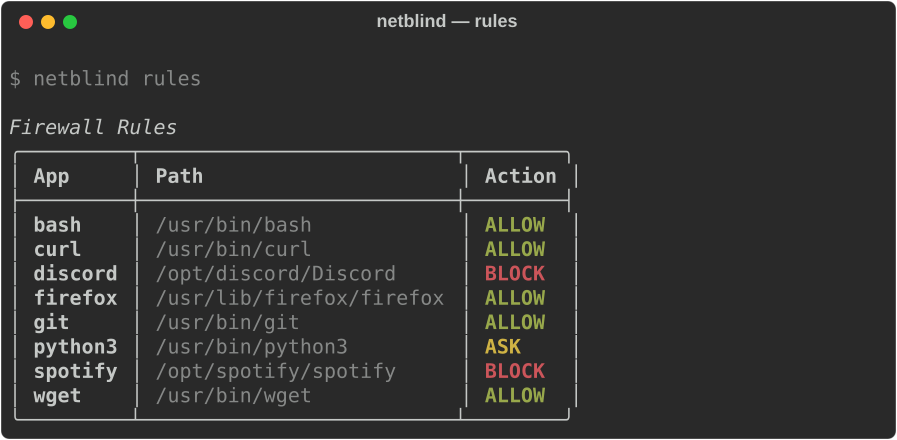
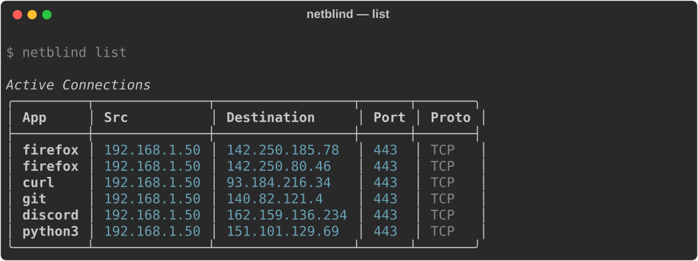
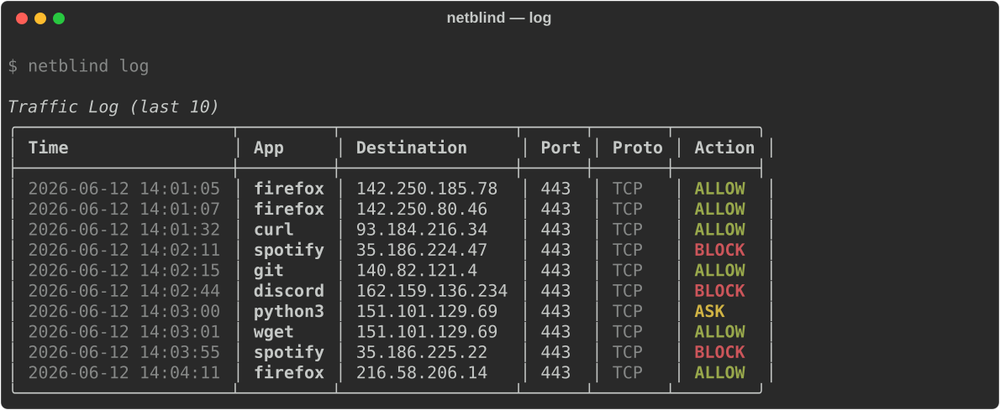
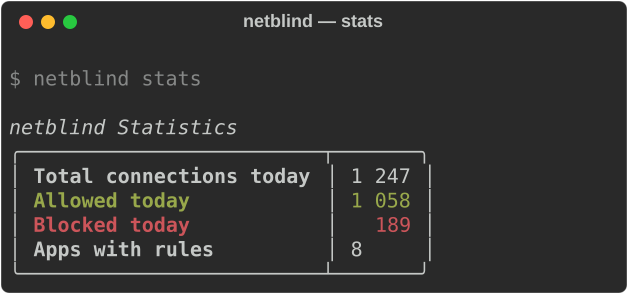
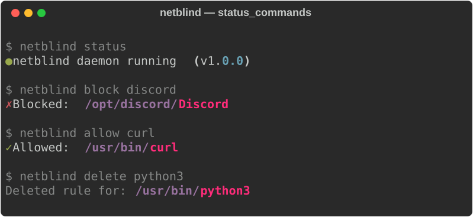
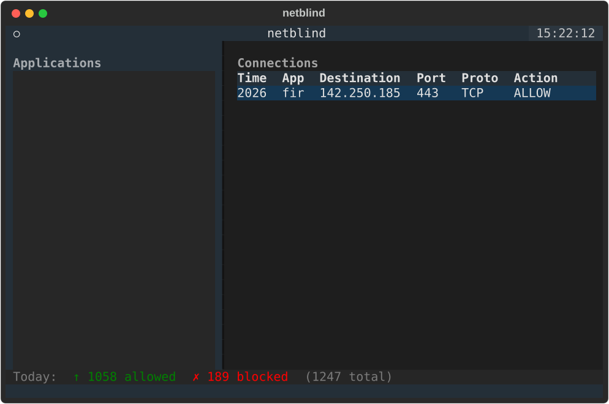

<div align="center">

# netblind

**Per-application outbound firewall for Linux**

[](LICENSE)
[](https://kernel.org)
[](https://go.dev)
[](https://python.org)
[](https://gtk.org)

*Think Little Snitch — but for Linux, open source, and free.*

[Features](#features) · [Screenshots](#screenshots) · [Install](#installation) · [Usage](#usage) · [How it works](#how-it-works) · [FAQ](#faq) · [Contributing](#contributing)

</div>

---

netblind sits between your applications and the internet. Every time an app makes an outbound connection for the first time, netblind shows you a desktop notification and asks: **Allow** or **Block?** Your answer is saved permanently and enforced at the kernel level via nftables.

No subscription. No cloud service. No phone home. Just kernel-level control over what leaves your machine.

---

## Features

| Feature | Description |
|---------|-------------|
| **Per-app rules** | Allow or block any application permanently — rules survive reboots |
| **Kernel enforcement** | Drops blocked traffic via nftables `socket cgroupv2` matching |
| **Live monitoring** | See every connection the moment it happens, refreshed every 2 seconds |
| **Desktop alerts** | Interactive notifications when an unknown app tries to connect |
| **Three interfaces** | GTK4 GUI · Textual TUI · Rich CLI — choose what fits your workflow |
| **Persistent storage** | SQLite-backed rule and traffic-log database |
| **Rolling log** | 7-day connection history, auto-purged on startup |
| **Zero residue** | All nftables rules removed cleanly on daemon shutdown |
| **Protocol support** | TCP and UDP, IPv4 and IPv6 |

---

## Screenshots

### CLI — `netblind rules`



### CLI — `netblind list`



### CLI — `netblind log`



### CLI — `netblind stats`



### CLI — status and control commands



### TUI — live two-pane monitor



**Keyboard shortcuts:** `a` allow · `b` block · `d` delete rule · `r` refresh · `?` help · `q` quit

### GUI — GTK4 + Adwaita

```
┌─ netblind ─────────────────[🔍 Filter by app or IP...]─[☰]─┐
│                                                               │
│ Applications       │ TIME                APP   DESTINATION   │
│ ─────────────────  │ 2026-06-12 14:01:05 curl  93.184.216.34 │
│ curl   [ALLOW]     │ 2026-06-12 14:02:11 wget  1.2.3.4       │
│ /usr/bin/curl      │ 2026-06-12 14:03:00 git   140.82.121.4  │
│                    │                                          │
│ discord [BLOCK]    │  (click any row for connection details)  │
│ /opt/discord/…     │                                          │
│                    │                                          │
│ firefox [ALLOW]    │                                          │
│ /usr/bin/firefox   │                                          │
│ ─────────────────  │                                          │
│ ● Daemon connected │     ↑ 1058 allowed  ✗ 189 blocked today │
└────────────────────┴─────────────────────────────────────────┘
```

*Right-click any app for a context menu · Click any row for a details popover · Search bar filters both panes in real time*

### Desktop notification

```
┌──────────────────────────────────────────┐
│  🔒  netblind alert                       │
│                                           │
│  spotify wants to connect to              │
│  104.199.65.124:443.                      │
│  Allow or block?                          │
│                                           │
│       [Block]   [Ask Later]   [Allow]     │
└──────────────────────────────────────────┘
```

---

## Use Cases

**Stop apps from calling home** — Electron apps, IDEs, and desktop tools often make undisclosed telemetry calls. netblind shows you exactly what's going out and lets you cut it off permanently.

**Audit unfamiliar binaries** — Running an open-source project or third-party binary you've never seen before? Watch every outbound connection in real time before deciding to trust it.

**Bandwidth control** — Block bandwidth-hungry background updaters (package managers, cloud sync) while keeping everything else online.

**Malware analysis** — Run a suspicious binary and observe its network behavior without it phoning home.

**Compliance logging** — Keep a 7-day rolling log of every outbound connection from every app on the machine.

---

## Requirements

| Component | Requirement |
|-----------|-------------|
| OS | Linux with kernel ≥ 5.13 and cgroupv2 enabled |
| Go | 1.21+ (to build the daemon) |
| Python | 3.11+ |
| nftables | `nft` in PATH |
| conntrack | `nf_conntrack` kernel module loaded |
| GUI only | GTK 4.0 + libadwaita |
| Notifications | D-Bus session bus (libnotify) |

> **cgroupv2:** netblind uses `socket cgroupv2` matching in nftables for per-app blocking. Verify it's available: `mount | grep cgroup2`. It's on by default in Arch, Fedora, Ubuntu 22.04+, and CachyOS.

---

## Installation

### Quick install

```bash
git clone https://github.com/dilates/netblind
cd netblind
sudo ./install.sh
```

Then start the daemon and refresh your group membership:

```bash
sudo systemctl start netblind
newgrp netblind        # or log out and back in
netblind status        # verify it's running
```

### Install Go (if needed)

```bash
# Arch / CachyOS
sudo pacman -S go

# Debian / Ubuntu
sudo apt-get install golang-go

# Fedora
sudo dnf install golang
```

### What `install.sh` does

1. Compiles the Go daemon → `/usr/local/bin/netblind-daemon`
2. Installs the Python clients via `pip install -e .`
3. Creates the `netblind` system group and adds `$SUDO_USER` to it
4. Installs and enables the systemd service
5. Installs a polkit rule for group-based access
6. Installs the `.desktop` entry for app launchers

### Manual install

```bash
# Build daemon
cd daemon
go mod download
CGO_ENABLED=1 go build -ldflags="-s -w" -o netblind-daemon .
sudo cp netblind-daemon /usr/local/bin/
cd ..

# Python clients
pip install -e .

# Group and service
sudo groupadd -f netblind
sudo usermod -aG netblind $USER
sudo cp install/netblind.service /etc/systemd/system/
sudo systemctl daemon-reload && sudo systemctl enable --now netblind

# Optional: polkit rule
sudo cp install/99-netblind.rules /etc/polkit-1/rules.d/

newgrp netblind
```

### Uninstall

```bash
sudo systemctl stop netblind && sudo systemctl disable netblind
sudo rm /usr/local/bin/netblind-daemon
sudo rm /etc/systemd/system/netblind.service
sudo rm /etc/polkit-1/rules.d/99-netblind.rules
sudo rm /usr/share/applications/netblind.desktop
pip uninstall netblind
sudo groupdel netblind
sudo rm -rf /var/lib/netblind
```

---

## Usage

### CLI

```bash
netblind status               # check daemon is running
netblind list                 # live outbound connections
netblind rules                # all saved rules
netblind log                  # recent traffic log
netblind log --limit 200      # last 200 entries
netblind stats                # today's allow/block counts

netblind allow firefox        # allow by name
netblind block /opt/spotify/spotify  # block by path
netblind delete wget          # remove rule (will ask again)

netblind --version
```

### TUI

```bash
netblind-tui
```

The sidebar shows every app with a color-coded rule badge. The right pane shows a live connection log filtered by the selected app.

| Key | Action |
|-----|--------|
| `a` | Allow selected app |
| `b` | Block selected app |
| `d` | Delete selected app's rule |
| `r` | Force refresh |
| `?` | Show help |
| `q` | Quit |

### GUI

```bash
netblind-gui
```

- **Sidebar** — all seen apps with rule badges. Click to filter. Right-click for a context menu.
- **Connection panel** — live log. Click any row for full details.
- **Search bar** — filters both panes by app name or destination IP.
- **Hamburger menu** — Preferences, View Log, About.
- **Status bar** — daemon state + today's counters.

---

## How it works

```
App → kernel → conntrack NEW event
                     │
                netblind daemon (Go, root)
                     │
          ┌──────────┼──────────────┐
          │          │              │
     /proc/net    SQLite DB     nftables
    (PID→path)  (rules+log)   (cgroupv2)
          │          │              │
          └──────────┼──────────────┘
                     │
              Unix socket (JSON-RPC 2.0)
                     │
          ┌──────────┼──────────────┐
          │          │              │
        netblind  netblind-tui  netblind-gui
         (CLI)    (Textual)      (GTK4)
```

**Daemon** — A Go binary running as root under systemd. It subscribes to conntrack NEW events via netlink. For each new TCP/UDP connection it walks `/proc/net/tcp*` to find the socket inode, then `/proc/<pid>/fd/` to find the owning process. If no rule exists, it sends a D-Bus notification asking the user.

**nftables** — On block, it reads the process cgroupv2 path from `/proc/<pid>/cgroup` and adds a `socket cgroupv2 level N "path" drop` rule to `inet netblind output`. The entire chain is flushed on shutdown — no lingering state.

**IPC** — All three Python clients share `clients/shared/rpc.py`, a thread-safe JSON-RPC 2.0 client that talks to the daemon over `/run/netblind.sock`.

**Race handling** — The resolver retries up to 3 times with 15 ms gaps, because new processes may not have registered their socket inode in `/proc` by the time the conntrack event fires.

---

## File structure

```
netblind/
├── daemon/
│   ├── main.go              ← entry point
│   ├── monitor/conntrack.go ← netlink conntrack subscription
│   ├── resolver/proc.go     ← PID/cgroup resolution via /proc
│   ├── rules/nftables.go    ← nft table/chain/rule management
│   ├── store/db.go          ← SQLite: rules + traffic_log
│   ├── alerts/notify.go     ← D-Bus notifications with action buttons
│   └── socket/server.go     ← JSON-RPC 2.0 Unix socket server
├── clients/
│   ├── shared/rpc.py        ← shared JSON-RPC 2.0 client
│   ├── cli/main.py          ← rich CLI (8 subcommands)
│   ├── tui/main.py          ← Textual TUI (2 s live refresh)
│   └── gui/main.py          ← GTK4 + Adwaita GUI
├── install/
│   ├── netblind.service     ← systemd unit
│   ├── 99-netblind.rules    ← polkit rule
│   └── netblind.desktop     ← XDG desktop entry
├── install.sh               ← one-shot installer
├── pyproject.toml           ← Python package
└── README.md
```

---

## Security model

| Who | What |
|-----|------|
| root (daemon) | Reads conntrack events, manages nftables, writes DB |
| netblind group | Connects to socket, reads log/rules, sets rules |
| Any user | Runs CLI/TUI/GUI (must be in the netblind group) |

- Socket permissions: `root:netblind 0660`
- Block rules use `socket cgroupv2` matching — scoped to the app's cgroup, not system-wide
- All rules removed on clean daemon shutdown — no hidden firewall state
- Database at `/var/lib/netblind/` (root-owned, mode 0750)

---

## Configuration

Daemon flags (set in the `ExecStart` line of the systemd unit):

| Flag | Default | Description |
|------|---------|-------------|
| `--socket` | `/run/netblind.sock` | Unix socket path |
| `--db` | `/var/lib/netblind/netblind.db` | SQLite database path |
| `--log-level` | `info` | Verbosity: `debug`, `info`, `warn` |

```bash
# Example: enable debug logging
# /etc/systemd/system/netblind.service → ExecStart=...  --log-level debug
sudo systemctl daemon-reload && sudo systemctl restart netblind
```

---

## Troubleshooting

**"netblind daemon is not running"**
```bash
sudo systemctl status netblind
sudo journalctl -u netblind -n 50
sudo systemctl start netblind
```

**"Permission denied accessing /run/netblind.sock"**
```bash
groups                              # check if netblind is listed
sudo usermod -aG netblind $USER
newgrp netblind                     # or log out and back in
```

**No connections appearing in the TUI/GUI**
```bash
# Verify the conntrack module is loaded
lsmod | grep nf_conntrack
sudo modprobe nf_conntrack
```

**Block rules not applying after daemon restart**

cgroupv2-based rules are tied to the running process's cgroup. If a blocked app is already running, restart it or wait for its next outbound connection. The DB-backed rule is enforced the moment a new connection is detected.

**Lingering rules after a daemon crash**
```bash
sudo nft delete table inet netblind
```

**cgroupv2 not available**
```bash
mount | grep cgroup2      # should show a cgroup2 mount
```
If missing, ensure your kernel has `CONFIG_SOCK_CGROUP_DATA=y` and systemd is managing cgroups (default on all modern distributions).

---

## FAQ

**Why cgroupv2 and not process name?**

nftables has no built-in process-name matcher. cgroupv2 hierarchy matching (`socket cgroupv2 level N "path"`) is the most reliable kernel-level mechanism for per-application traffic control on modern Linux.

**What if the same binary runs in multiple instances?**

netblind matches by cgroupv2 scope. In most DE sessions (GNOME, KDE), each launched app gets its own cgroup scope, so multiple instances are handled cleanly. Terminal sessions typically share a scope.

**Does it block root processes?**

Outbound connections from root processes bypass user-space decisions. netblind logs them, but kernel-level blocking of root processes requires additional nftables policy (`meta skuid 0`).

**Does it affect inbound connections?**

No. netblind only monitors and controls **outbound** connections.

**Can I use it alongside ufw or firewalld?**

Yes. netblind creates its own `inet netblind` table and does not touch any other table or chain.

**Does it work without systemd?**

The daemon works on any init system. Start it manually: `sudo netblind-daemon &`. The installer and group setup assume systemd.

**Where is my data?**

Entirely local: `/var/lib/netblind/netblind.db`. Nothing is sent anywhere. Logs are purged after 7 days.

---

## Contributing

Contributions are welcome. This project is maintained by [dilates](https://github.com/dilates).

```bash
git clone https://github.com/dilates/netblind
cd netblind
pip install -e .
cd daemon && go build ./...
```

**Open areas:**
- [ ] Test suite for the Python clients
- [ ] Go unit tests for resolver and nftables modules
- [ ] GTK4-native system tray support (libayatana-appindicator4)
- [ ] DNS reverse lookup for destination IPs in connection details
- [ ] Per-rule expiry ("allow for 1 hour")
- [ ] Default-deny global policy mode
- [ ] AUR / .deb / .rpm packaging

Please open an issue before starting large changes.

---

## License

**GPL-3.0** — see [LICENSE](LICENSE).

---

<div align="center">

Made with care by **[dilates](https://github.com/dilates)**

[⭐ Star on GitHub](https://github.com/dilates/netblind) · [🐛 Report a bug](https://github.com/dilates/netblind/issues) · [💡 Request a feature](https://github.com/dilates/netblind/issues)

**Litecoin (LTC) donations:** `LZkNEPvTt9MhGTHuYvhsGSPqw91odZRX4j`

</div>
 